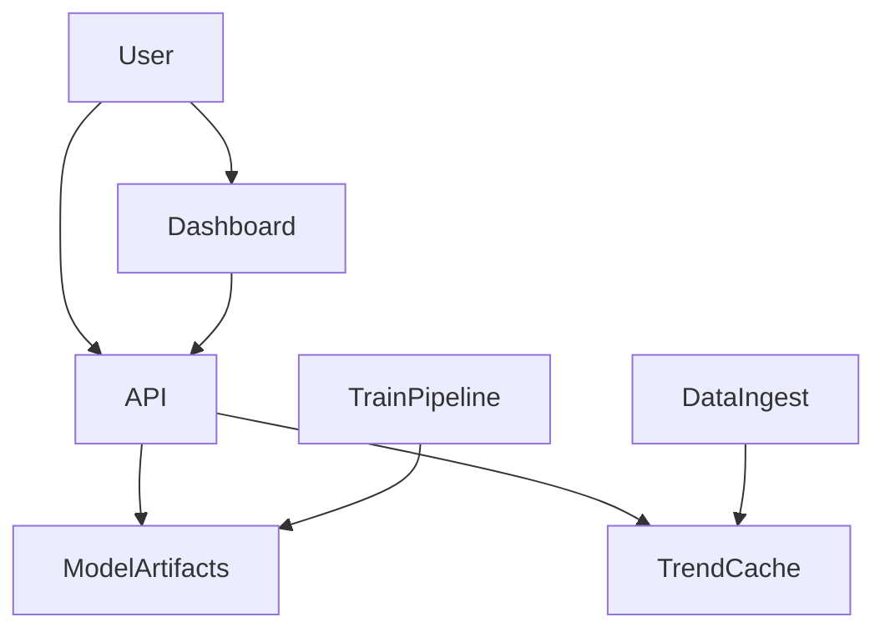

# Architecture

This document describes the production-style architecture for the California Housing Price Predictor.

## System overview

## Components

- **API**: FastAPI service that serves predictions, batch inference, comparisons, trends, and insights.
- **Dashboard**: Streamlit app for interactive map visualization, comparisons, and time-series trends.
- **Training pipeline**: Offline training and evaluation that saves model artifacts and reports.
- **Data ingest**: Public data fetchers (FRED HPI) cached to local artifacts for repeatable demos.

## Data flow

1. Training pipeline builds multiple models, evaluates them, and saves the best model to `artifacts/models/`.
2. API loads model artifacts on startup and serves real-time predictions.
3. Dashboard queries the API for predictions and overlays public trend data.
4. Trend data is cached to `artifacts/trends/` to avoid repeated network calls.

## Scalability notes

- **Horizontal scaling**: API instances can scale horizontally because model artifacts are immutable and read-only.
- **Caching**: Trend data is cached on disk; model artifacts are loaded once per process.
- **Cold starts**: If artifacts are missing, API falls back to training in-memory (can be disabled in production).
- **Batch inference**: `/predict-batch` supports bulk requests for dashboard and analytics.
